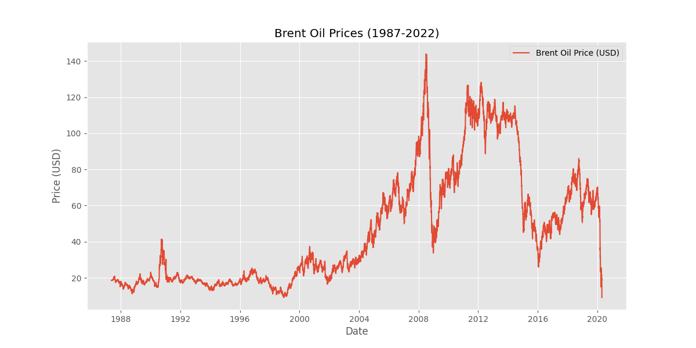
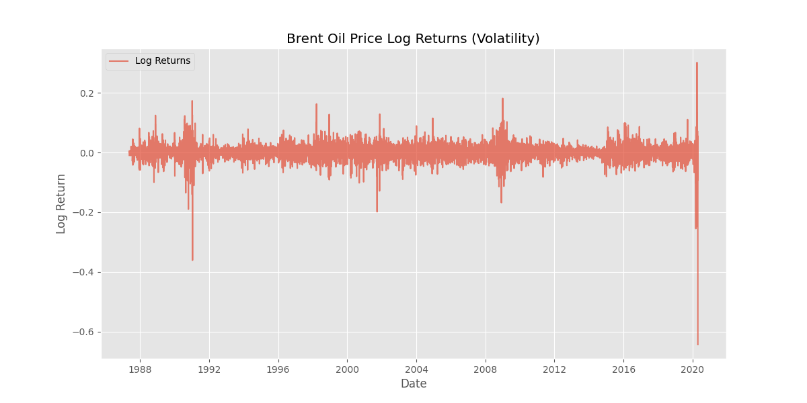
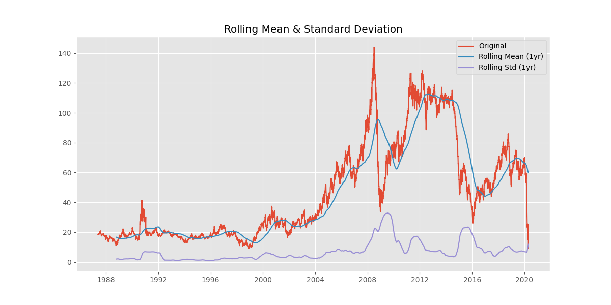

# Interim Report: Brent Oil Change Point Analysis
**Date**: February 8, 2026 | **Author**: Data Science Team | **Version**: 1.1

## Executive Summary
This report summarizes the foundational analysis of Brent oil prices (1987-2020) to identify structural breaks caused by geopolitical events. We confirmed the non-stationarity of prices, compiled a dataset of 14 key events, and validated the need for Bayesian Change Point modeling.

## 1. Project Objectives
-   **Analyze** the impact of major political/economic events on Brent oil prices.
-   **Quantify** price level and volatility shifts using Bayesian inference.
-   **Visualize** insights via an interactive dashboard for stakeholders.

## 2. Completed Work (Task 1)

### 2.1 Data & Event Compilation
-   **Price Data**: 8,360 daily observations (May 1987 – April 2020). *Note: Data ends in 2020, excluding the 2022 Russia-Ukraine war.*
-   **Events**: Compiled 14 major events including the Gulf War (1990), 2008 Financial Crisis, and COVID-19 Pandemic. (See `data/processed/events.csv`)

### 2.2 Exploratory Data Analysis (EDA) Findings
**Finding 1: Regime Changes & Non-Stationarity**
The price series exhibits distinct regimes with sharp structural breaks, confirmed by the ADF test (p-value 0.28 > 0.05, fail to reject null).

**Finding 2: Volatility Clustering**
Log returns are stationary (p-value 0.00) but show clusters of high volatility during crisis periods (1991, 2008, 2014, 2020).

**Finding 3: Rolling Statistics**
Rolling mean and standard deviation visualizes the changing baseline and risk profile over time.

## 3. Methodology & Next Steps

### 3.1 Algorithm Selection
We selected **Bayesian Change Point Detection (PyMC)** because it:
1.  Explicitly models discrete shifts in mean and variance (unlike ARIMA).
2.  Provides probabilistic uncertainty estimates for change point dates.
3.  Handles the non-stationary nature of the data naturally.

### 3.2 Roadmap

#### Task 2: Change Point Modeling (Immediate Focus)
-   [ ] Implement PyMC model with switch point (`tau`) priors.
-   [ ] Run MCMC sampling to detect break dates.
-   [ ] Quantify % impact on price mean/volatility pre- and post-event.

#### Task 3: Dashboard Development (Future Work)
-   [ ] **Backend (Flask)**:
    -   API `/api/price-data`: Serve historical data.
    -   API `/api/change-points`: Serve detected break dates and statistics.
-   [ ] **Frontend (React)**:
    -   **Interactive Chart**: Recharts/Chart.js line chart with zoom and pan.
    -   **Event Overlay**: vertical markers for events and detected changes.
    -   **Analysis Panel**: Display selected event statistics (magnitude, duration).

## 4. Assumptions & Limitations
-   **Correlation ≠ Causation**: Detected breaks indicate association, not causality.
-   **Data Limit**: Analysis is restricted to pre-April 2020 data.
-   **Market Efficiency**: Prices are assumed to react rapidly to major news.

---
**Repository**: `c:\weak11\brent-oil-change-point-analysis` | **Contact**: Data Science Team
